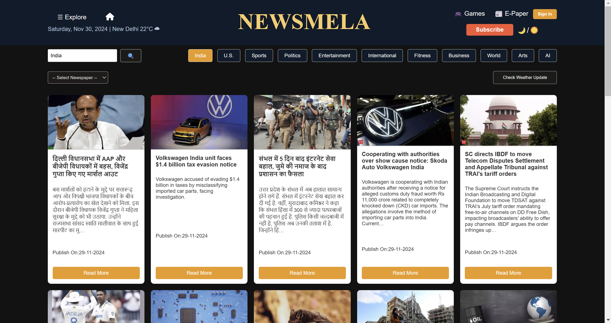
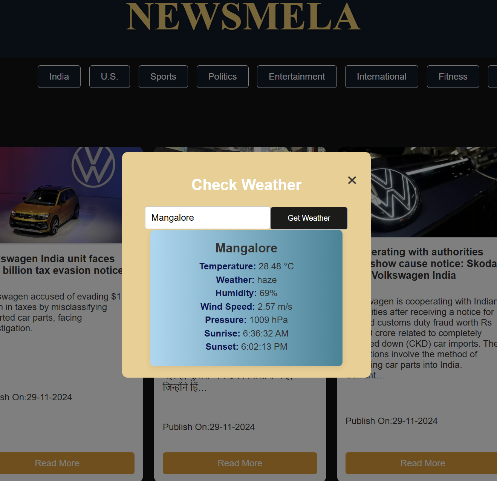

# NEWSMELA - News Aggregation Platform

NEWSMELA is a dynamic news aggregation platform that collects and displays headlines from multiple newspapers. It allows users to filter news by categories like sports, politics, entertainment, and international, and provides real-time weather updates.

## Features

- **Multi-source News Aggregation**: Pulls in headlines from various news sources.
- **Category Filtering**: Filter news by categories such as:
  - Sports
  - Politics
  - Entertainment
  - International
  - fitness
  - more 
- **Weather Updates**: Real-time weather updates based on user location.
- **Currency Convertor**: Currency converter tool that allows users to convert between different currencies using live exchange rates.
- **Theme Toggole**: Light and Dark Mode.
- **Responsive Design**: Fully responsive design, optimized for mobile and desktop.

## Tech Stack

- **Frontend**: HTML, CSS, JavaScript
- **Backend**: Node.js, Express
- **Weather API**: OpenWeather API (or any weather service API)
- **News API**: Integrated with news APIs for fetching the latest headlines.

## Note: API Fetching Issues after Deployment

Due to an issue with fetching data from the News API after deployment (such as CORS errors, API key restrictions, or server configuration problems), the live version of this project might not display the news articles as expected. 

To give you an idea of how the website looks and functions, I've provided a screenshot of the working local version of the site below:

## Screenshots

# what makes NewsMela unique:

## 1. Aggregated News Across Multiple Categories
NewsMela collects and displays news from various sources, offering a 360-degree view of global and regional events.

## 2. User-Centric Features
With dynamic filtering and real-time weather updates, users can access personalized news and location-based weather in one place.

## 3. Interactive and Engaging Interface
Intuitive search options, category buttons, and customizable light/dark themes enhance user experience.

## 4. Modern Design with Responsive UI
Optimized for all devices, NewsMela ensures seamless navigation and a clean layout across desktops, tablets, and mobiles.

## 5. Integration of Technology
Real-time news and weather updates powered by APIs ensure users get the latest and most accurate information.

## 6. Educational and Analytical Features
Detailed news insights and optional user interaction via comments foster a more informed and engaged community.

## 7. Global and Local Balance
Combines global headlines with regional news and weather updates for a comprehensive and balanced perspective.

## 8. Entertainment and Utility Combo
Integrates features like Games and E-Paper to provide a daily mix of leisure and productivity.

## 9. Subscription Options
Optional ad-free and premium content subscription models add value for users seeking an exclusive experience.

## 10. Sleek Branding and Theme
The bold and catchy NEWSMELA branding stands out, supported by a mission to deliver aggregated and personalized content.

## Contributing
 Feel free to fork this repository and contribute by submitting a pull request. Any improvements, bug fixes, or new features are welcome!

