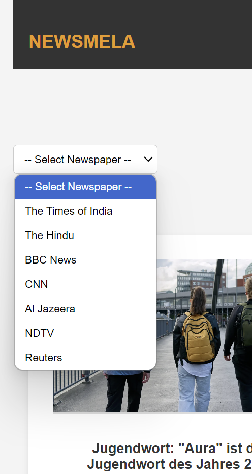
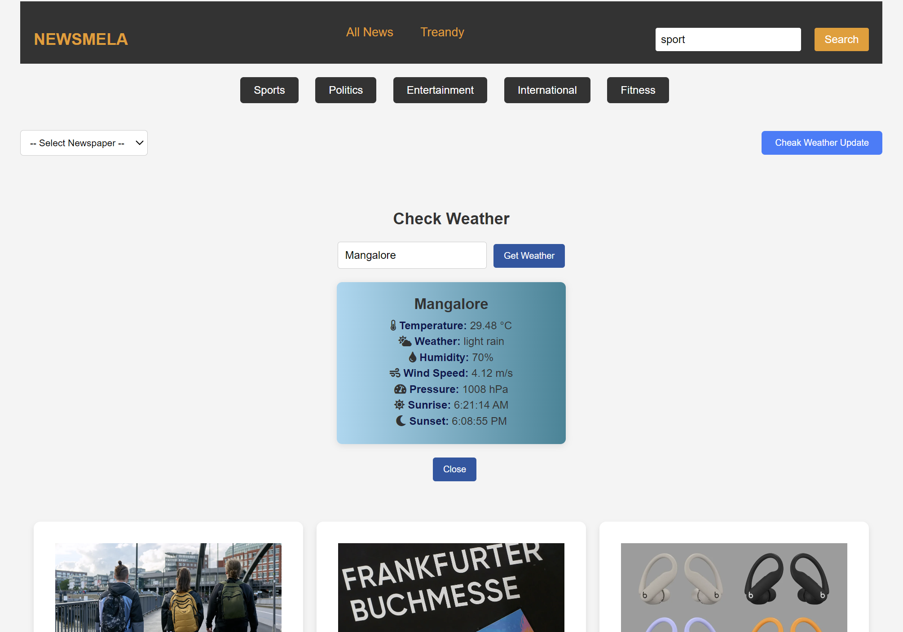

# NEWSMELA - News Aggregation Platform

NEWSMELA is a dynamic news aggregation platform that collects and displays headlines from multiple newspapers. It allows users to filter news by categories like sports, politics, entertainment, and international, and provides real-time weather updates.

## Features

- **Multi-source News Aggregation**: Pulls in headlines from various news sources.
- **Category Filtering**: Filter news by categories such as:
  - Sports
  - Politics
  - Entertainment
  - International
  - fitness
- **Weather Updates**: Real-time weather updates based on user location.
- **Responsive Design**: Fully responsive design, optimized for mobile and desktop.

## Tech Stack

- **Frontend**: HTML, CSS, JavaScript
- **Backend**: Node.js, Express
- **Weather API**: OpenWeather API (or any weather service API)
- **News API**: Integrated with news APIs for fetching the latest headlines.

## Note: API Fetching Issues after Deployment

Due to an issue with fetching data from the News API after deployment (such as CORS errors, API key restrictions, or server configuration problems), the live version of this project might not display the news articles as expected. 

To give you an idea of how the website looks and functions, I've provided a screenshot of the working local version of the site below:

## Screenshots

## Contributing
 Feel free to fork this repository and contribute by submitting a pull request. Any improvements, bug fixes, or new features are welcome!

